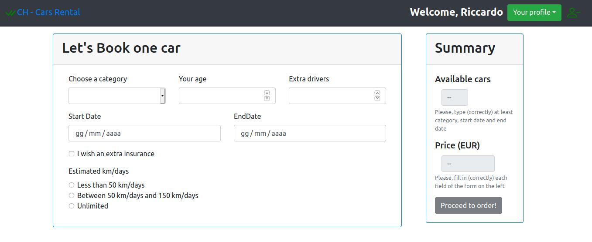

# Esame #1: "Noleggio auto" (29/06/2020)
## Student: s269094 TEDESCO RICCARDO 

## React client application routes

- Route `/catalogue`: contiene la lista dei veicoli; la lista è aggiornabile in tempo reale. 
- Route `/login`: contiene un form che consente di accedere alle sezioni "riservate" della REACT Single Page Application.
- Route `/rental`: contiene il configuratore interattivo per noleggiare una macchina e un ulteriore riquadro che interattivamente (basandosi sui dati forniti nel configuratore) visualizzerà il numero di auto disponibili e il prezzo del noleggio. Se l'utente conferma di voler procedere con il pagamento, il contenuto della pagina sarà rimpiazzato con un form che consentirà all'utente di inserire le informazioni della sua carta di credito. Route accessibile solo dopo aver effettuato il login.
- Route `/your-rentals`: contiene un riquadro con tre pulsanti (past, current, future) che visualizzano una tabella che rispettivamente contiene i noleggi passati, i noleggi attualmente attivi e i noleggi futuri. Nel caso dei noleggi futuri, sarà possibile cancellarli. Route accessibile solo dopo aver effettuato il login.
## REST API server

- POST `/api/login`
  - request body content: è costituito dalla email (username) e dalla password. 
  - response body content: è costituito, nel caso in cui l'autenticazione vada a buon fine, da un oggetto contenente le informazioni (email, nome, cognome, numero di noleggi effettuati) dell'utente e dal relativo cookie. 
- POST `/api/logout`
- GET `/api/csrf-token`
  - response body content: un cookie utile contro le vulnerabilità di tipo CSRF. 
- GET `/api/users`
  - response body content: un oggetto contenente le informazioni dell'utente attualmente loggato. 
- GET `/api/vehicles`
  - request query parameters: nessuno oppure category, startDate e endDate.
  - response body content: nel caso in cui non siano stati specificati i request query parameters, conterrà un oggetto avente l'elenco di tutti i veicoli disponibili, altrimenti conterrà un oggetto con il numero di auto della categoria 'category' disponibili nel periodo di tempo compreso tra 'startDate' e 'endDate'.
- GET `/api/prices`
  - request query parameters: category, age, startDate, endDate, extraDrivers, extraInsurance, estimatedKm, numberOfRentals. numberOfRentals indica il numero di noleggi dell'utente. 
  - response body content: un oggetto contenente il prezzo del noleggio calcolato a partire dai request query parameters.
- POST `/api/reservations`
  - request body content: i dati del noleggio (categoria, età guidatore, data di inzio, data di fine, guidatori extra, assicurazione extra, numero di noleggi, prezzo).
  - response body content: un oggetto vuoto nel caso in cui sia possibile confermare la prenotazione, ossia nel caso in cui tutti i dati del noleggio (si ricalcola quindi anche il prezzo) risultano essere validi.
- POST `/api/payments`
  - request body content: il nome dell'utente, il codice della carta di credito, il CCV e l'importo da pagare.
  - response body content: un oggetto contenente un messaggio che indica che la transazione è andata a buon fine (il che si verifica sempre a meno che il contenuto del body sia invalido).
- POST `/api/rentals`
  - request body content: i dati relativi al noleggio effettuato.
  - response body content: Vuoto nel caso in cui non siano riscontrati problemi durante la creazione del noleggio. 
- GET `/api/rentals`
  - request query parameters: period. I valori ammissibili per il parametro sono: "past" (noleggi passati), "current" (noleggi attualmente attivi), "future" (noleggi futuri). Il parametro 'period' indica quali sono i noleggi che un utente ha indicato che si vogliono ottenere.
  - response body content: un oggetto contenente l'elenco dei noleggi che l'utente ha effettuato nel periodo indicato. 
- DELETE `/api/rentals/:id`
  - request parameters: identificativo (id) del noleggio che si vuole rimuovere (rimozione valida solo per noleggi futuri).
N.B.: Le uniche API che NON richiedono autenticazione sono: /api/login, api/prices, api/vehicles

## Server database

- Table `USERS` - Contiene le informazioni (email (ID), Nome, Cognome, HashPassword e numero di noleggi effettuati) relative agli utenti registrati. 
- Table `VEHICLES` - contiene la lista dei veicoli disponibili (ID, categoria, marca e modello). In totale sono presenti 27 veicoli (11 della categoria A, 4 della categoria B, 5 della categoria C, 4 della categoria D e 3 della categoria E) di 5 marche differenti.
- Table `RENTALS` - contiene l'elenco di tutti i noleggi effettuati. I campi sono: ID, IDUser (ossia indirizzo email dell'utente che ha effettuato il noleggio), categoria dell'auto noleggiata, data di inizio del noleggio, data di fine del noleggio e altre informazioni addizionali (età guidatore, numero di eventuali guidatori aggiuntivi, se è stata richiesta o meno un'assicurazione extra e il numero stimato di chilometri giornalieri da percorrere).

## Main React Components

- `Login` (in `Components/Login/LoginComponents.js`): Consente di effettuare il login. E' il padre del componente LoginForm definito nel medesimo percorso. 
- `MultipleFilter` (in `Components/Catalogue/MultipleFilter.js`): consente di selezionare più filtri contemporaneamente per i veicoli. Per eseguire il suo compito, sfrutta il componente react "MultiSelect". 
- `VehicleList` (in `Components/Catalogue/VehicleList.js`): visualizza l'elenco dei veicoli filtrati (è necessario applicare almeno un filtro).
- `Configurator` (in `Components/Configurator/Configurator.js`): Controlla la pagina di configurazione dei noleggi.
- `ConfiguratorPseudoForm` (in `Components/Configurator/Configurator.js`): Componente figlio di Configurator che consente di settare i parametri da fornire poi a Configurator per la validazione e si occupa inoltre di visualizzare opportuni messaggi di errore. 
- `ResultsPseudoForm` (in `Components/Configurator/Configurator.js`): Componente figlio di Configurator che, a partire dai parametri di configurazione, si occupa di eseguire le oppotune chiamate REST per calcolare il prezzo e il numero di veicoli disponibili. Consente inoltre di prenotare e procedere con il pagamento.
- `PayForm` (in `Components/Configurator/PayForm.js`): Una volta che l'utente indica di voler pagare, rimpiazza la pagina di configurazione con un form per inserire i dati della carta di credito.
- `UserRentals` (in `Components/UserProfile/UserRentals.js`): Consente all'utente autenticato di consultare la lista dei suo noleggi passati, attivi e futuri; consente inoltre di rimuovere i noleggi futuri.
- `TitleBar` (in `Components/TitleBar.js`): Fornisce i pulsanti per accedere alla pagina di login. Una volta autenticati, fornisce i pulsanti per accedere alla lista di tutti i noleggi dell'utente e fornisce il pulsante per effettuare il logout. 

## Screenshot

## Test users (username, password)

* ricky@poli.it, riccardo96 (cliente frequente, 3 noleggi effettuati)
* pippo@voda.it, Goofy1960 (2 noleggi effettuati)
* mario@rtsm.com, supreme19 
* yuurei@voda.it, yuurei_bana97 (1 noleggio effettuato)
* fabian@rtsm.com, razor 
* miss_hg@voda.it, missHg95
